# Quick Skin

<!-- branch-profile:start -->
<!-- Generated by scripts/release/branch_readme.py from the release matrix. -->
[](https://github.com/The-Plum-Team/Quick-Skin-Mod/actions/workflows/build-gate.yml?query=branch%3Amaster)

Quick Skin is a client-and-server Minecraft mod for changing skins and capes in-game. It supports synchronized appearances, HD textures, animated capes and optional integrations.

[Modrinth](https://modrinth.com/mod/quick-skin) · [CurseForge](https://www.curseforge.com/minecraft/mc-mods/quick-skin)

## Shared multi-version source

Features and compatibility adapters compile as separate Gradle modules. The selected modules are assembled into one production JAR per Minecraft and loader target. `architecture/modules.json` owns module dependencies; `release/release-matrix.json` owns the targets currently configured in this checkout:

| Minecraft | Loaders | Java |
|---|---|---:|
| `1.20.1` | Fabric + Forge | `17` |
| `1.21.1` | Fabric + NeoForge | `21` |
| `1.21.2` | Fabric + NeoForge | `21` |
| `1.21.3` | Fabric + NeoForge | `21` |
| `1.21.4` | Fabric + NeoForge | `21` |
| `1.21.5` | Fabric + NeoForge | `21` |
| `1.21.6` | Fabric + NeoForge | `21` |
| `1.21.7` | Fabric + NeoForge | `21` |
| `1.21.8` | Fabric + NeoForge | `21` |
| `1.21.9` | Fabric + NeoForge | `21` |
| `1.21.10` | Fabric + NeoForge | `21` |
| `1.21.11` | Fabric + NeoForge | `21` |
| `26.1` | Fabric + NeoForge | `25` |
| `26.1.1` | Fabric + NeoForge | `25` |
| `26.1.2` | Fabric + NeoForge | `25` |
| `26.2` | Fabric + NeoForge | `25` |

All targets build from the same source revision. Publication identity remains per Minecraft version (`mc<version>-v<mod_version>`); the complete build bundle is not a publishable release. Dependency ranges remain in the matrix and generated JAR metadata.

The [migration plan](docs/architecture/MODULAR-REWORK.md) records the remaining target imports, CI and publication work. Existing published releases and their remote evidence remain listed below during migration.
<!-- branch-profile:end -->

## Verified releases

Each release branch has independent build and packaged-Minecraft E2E evidence. After an automated
port, the final branch badges attest that its exact Git tree is the tree already tested; Minecraft
is not launched a second time merely to publish the result.

<!-- release-status:start -->
<!-- Generated by scripts/release/status_table.py; do not edit this block manually. -->
| Minecraft | Loaders | Java | Build | Packaged E2E | Branch |
|---|---|---:|:---:|:---:|---|
| 26.2 | Fabric + NeoForge | 25 | [](https://github.com/The-Plum-Team/Quick-Skin-Mod/actions/workflows/build-gate.yml?query=branch%3Afabric-and-neoforge-26.2) | [](https://github.com/The-Plum-Team/Quick-Skin-Mod/actions/workflows/on-demand-e2e.yml?query=branch%3Afabric-and-neoforge-26.2) | [`fabric-and-neoforge-26.2`](https://github.com/The-Plum-Team/Quick-Skin-Mod/tree/fabric-and-neoforge-26.2) |
| 26.1.2 | Fabric + NeoForge | 25 | [](https://github.com/The-Plum-Team/Quick-Skin-Mod/actions/workflows/build-gate.yml?query=branch%3Afabric-and-neoforge-26.1.2) | [](https://github.com/The-Plum-Team/Quick-Skin-Mod/actions/workflows/on-demand-e2e.yml?query=branch%3Afabric-and-neoforge-26.1.2) | [`fabric-and-neoforge-26.1.2`](https://github.com/The-Plum-Team/Quick-Skin-Mod/tree/fabric-and-neoforge-26.1.2) |
| 26.1.1 | Fabric + NeoForge | 25 | [](https://github.com/The-Plum-Team/Quick-Skin-Mod/actions/workflows/build-gate.yml?query=branch%3Afabric-and-neoforge-26.1.1) | [](https://github.com/The-Plum-Team/Quick-Skin-Mod/actions/workflows/on-demand-e2e.yml?query=branch%3Afabric-and-neoforge-26.1.1) | [`fabric-and-neoforge-26.1.1`](https://github.com/The-Plum-Team/Quick-Skin-Mod/tree/fabric-and-neoforge-26.1.1) |
| 26.1 | Fabric + NeoForge | 25 | [](https://github.com/The-Plum-Team/Quick-Skin-Mod/actions/workflows/build-gate.yml?query=branch%3Afabric-and-neoforge-26.1) | [](https://github.com/The-Plum-Team/Quick-Skin-Mod/actions/workflows/on-demand-e2e.yml?query=branch%3Afabric-and-neoforge-26.1) | [`fabric-and-neoforge-26.1`](https://github.com/The-Plum-Team/Quick-Skin-Mod/tree/fabric-and-neoforge-26.1) |
| 1.21.11 | Fabric + NeoForge | 21 | [](https://github.com/The-Plum-Team/Quick-Skin-Mod/actions/workflows/build-gate.yml?query=branch%3Afabric-and-neoforge-1.21.11) | [](https://github.com/The-Plum-Team/Quick-Skin-Mod/actions/workflows/on-demand-e2e.yml?query=branch%3Afabric-and-neoforge-1.21.11) | [`fabric-and-neoforge-1.21.11`](https://github.com/The-Plum-Team/Quick-Skin-Mod/tree/fabric-and-neoforge-1.21.11) |
| 1.21.10 | Fabric + NeoForge | 21 | [](https://github.com/The-Plum-Team/Quick-Skin-Mod/actions/workflows/build-gate.yml?query=branch%3Afabric-and-neoforge-1.21.10) | [](https://github.com/The-Plum-Team/Quick-Skin-Mod/actions/workflows/on-demand-e2e.yml?query=branch%3Afabric-and-neoforge-1.21.10) | [`fabric-and-neoforge-1.21.10`](https://github.com/The-Plum-Team/Quick-Skin-Mod/tree/fabric-and-neoforge-1.21.10) |
| 1.21.9 | Fabric + NeoForge | 21 | [](https://github.com/The-Plum-Team/Quick-Skin-Mod/actions/workflows/build-gate.yml?query=branch%3Afabric-and-neoforge-1.21.9) | [](https://github.com/The-Plum-Team/Quick-Skin-Mod/actions/workflows/on-demand-e2e.yml?query=branch%3Afabric-and-neoforge-1.21.9) | [`fabric-and-neoforge-1.21.9`](https://github.com/The-Plum-Team/Quick-Skin-Mod/tree/fabric-and-neoforge-1.21.9) |
| 1.21.8 | Fabric + NeoForge | 21 | [](https://github.com/The-Plum-Team/Quick-Skin-Mod/actions/workflows/build-gate.yml?query=branch%3Afabric-and-neoforge-1.21.8) | [](https://github.com/The-Plum-Team/Quick-Skin-Mod/actions/workflows/on-demand-e2e.yml?query=branch%3Afabric-and-neoforge-1.21.8) | [`fabric-and-neoforge-1.21.8`](https://github.com/The-Plum-Team/Quick-Skin-Mod/tree/fabric-and-neoforge-1.21.8) |
| 1.21.7 | Fabric + NeoForge | 21 | [](https://github.com/The-Plum-Team/Quick-Skin-Mod/actions/workflows/build-gate.yml?query=branch%3Afabric-and-neoforge-1.21.7) | [](https://github.com/The-Plum-Team/Quick-Skin-Mod/actions/workflows/on-demand-e2e.yml?query=branch%3Afabric-and-neoforge-1.21.7) | [`fabric-and-neoforge-1.21.7`](https://github.com/The-Plum-Team/Quick-Skin-Mod/tree/fabric-and-neoforge-1.21.7) |
| 1.21.6 | Fabric + NeoForge | 21 | [](https://github.com/The-Plum-Team/Quick-Skin-Mod/actions/workflows/build-gate.yml?query=branch%3Afabric-and-neoforge-1.21.6) | [](https://github.com/The-Plum-Team/Quick-Skin-Mod/actions/workflows/on-demand-e2e.yml?query=branch%3Afabric-and-neoforge-1.21.6) | [`fabric-and-neoforge-1.21.6`](https://github.com/The-Plum-Team/Quick-Skin-Mod/tree/fabric-and-neoforge-1.21.6) |
| 1.21.5 | Fabric + NeoForge | 21 | [](https://github.com/The-Plum-Team/Quick-Skin-Mod/actions/workflows/build-gate.yml?query=branch%3Afabric-and-neoforge-1.21.5) | [](https://github.com/The-Plum-Team/Quick-Skin-Mod/actions/workflows/on-demand-e2e.yml?query=branch%3Afabric-and-neoforge-1.21.5) | [`fabric-and-neoforge-1.21.5`](https://github.com/The-Plum-Team/Quick-Skin-Mod/tree/fabric-and-neoforge-1.21.5) |
| 1.21.4 | Fabric + NeoForge | 21 | [](https://github.com/The-Plum-Team/Quick-Skin-Mod/actions/workflows/build-gate.yml?query=branch%3Afabric-and-neoforge-1.21.4) | [](https://github.com/The-Plum-Team/Quick-Skin-Mod/actions/workflows/on-demand-e2e.yml?query=branch%3Afabric-and-neoforge-1.21.4) | [`fabric-and-neoforge-1.21.4`](https://github.com/The-Plum-Team/Quick-Skin-Mod/tree/fabric-and-neoforge-1.21.4) |
| 1.21.3 | Fabric + NeoForge | 21 | [](https://github.com/The-Plum-Team/Quick-Skin-Mod/actions/workflows/build-gate.yml?query=branch%3Afabric-and-neoforge-1.21.3) | [](https://github.com/The-Plum-Team/Quick-Skin-Mod/actions/workflows/on-demand-e2e.yml?query=branch%3Afabric-and-neoforge-1.21.3) | [`fabric-and-neoforge-1.21.3`](https://github.com/The-Plum-Team/Quick-Skin-Mod/tree/fabric-and-neoforge-1.21.3) |
| 1.21.2 | Fabric + NeoForge | 21 | [](https://github.com/The-Plum-Team/Quick-Skin-Mod/actions/workflows/build-gate.yml?query=branch%3Afabric-and-neoforge-1.21.2) | [](https://github.com/The-Plum-Team/Quick-Skin-Mod/actions/workflows/on-demand-e2e.yml?query=branch%3Afabric-and-neoforge-1.21.2) | [`fabric-and-neoforge-1.21.2`](https://github.com/The-Plum-Team/Quick-Skin-Mod/tree/fabric-and-neoforge-1.21.2) |
| 1.21.1 | Fabric + NeoForge | 21 | [](https://github.com/The-Plum-Team/Quick-Skin-Mod/actions/workflows/build-gate.yml?query=branch%3Afabric-and-neoforge-1.21.1) | [](https://github.com/The-Plum-Team/Quick-Skin-Mod/actions/workflows/on-demand-e2e.yml?query=branch%3Afabric-and-neoforge-1.21.1) | [`fabric-and-neoforge-1.21.1`](https://github.com/The-Plum-Team/Quick-Skin-Mod/tree/fabric-and-neoforge-1.21.1) |
| 1.20.1 | Fabric + Forge | 17 | [](https://github.com/The-Plum-Team/Quick-Skin-Mod/actions/workflows/build-gate.yml?query=branch%3Aforge-and-fabric-1.20.1) | [](https://github.com/The-Plum-Team/Quick-Skin-Mod/actions/workflows/on-demand-e2e.yml?query=branch%3Aforge-and-fabric-1.20.1) | [`forge-and-fabric-1.20.1`](https://github.com/The-Plum-Team/Quick-Skin-Mod/tree/forge-and-fabric-1.20.1) |
<!-- release-status:end -->

[Project hub](https://the-plum-team.github.io/Quick-Skin-Mod/) ·
[Visual E2E gallery](https://the-plum-team.github.io/Quick-Skin-Mod/e2e/) ·
[Machine-readable gallery inventory](https://the-plum-team.github.io/Quick-Skin-Mod/e2e/gallery-data.json)

## E2E validation flow

A pull request to `master` runs deterministic checks but never enters the Claude queue. After the
merge, the cumulative generation is admitted once through the 1.20.1 anchor. The release matrix
discovers every version and loader shown below; this diagram does not maintain a second version
list.

```mermaid
flowchart TD
    PR["Pull request to master"] --> PRE["Build gate + full packaged E2E<br/>No PR-side Claude review"]
    PRE --> PRE_OK{"Deterministic checks pass?"}
    PRE_OK -->|No| FIX["Fix the pull request"]
    FIX --> PR
    PRE_OK -->|Yes| MERGE["Merge into master"]

    MERGE --> ANCHOR["Sync cumulative generation to the 1.20.1 anchor"]
    ANCHOR --> ANCHOR_E2E["Build + full packaged E2E<br/>Fabric and Forge in parallel"]
    ANCHOR_E2E --> ANCHOR_OK{"Anchor checks clean?"}
    ANCHOR_OK -->|No| STOP["Stop propagation"]
    ANCHOR_OK -->|Yes| ANCHOR_MERGE["Merge the exact tested 1.20.1 tree<br/>Publish Build/E2E attestations"]
    ANCHOR_MERGE --> IMPACT{"Complete anchor diff"}

    IMPACT -->|Allowlisted nonvisual| NONVIS["Authenticated nonvisual certificate<br/>No Claude or mod-compatibility wave"]
    IMPACT -->|Visual, runtime, or unknown| CURATE["Curate authenticated lossless screenshots<br/>Fabric and Forge; no reference image"]

    CURATE --> CAPACITY{"Claude capacity available?"}
    CAPACITY -->|No| QUEUE["Keep the durable capsule<br/>Retry later"]
    QUEUE --> CAPACITY
    CAPACITY -->|Yes| HAIKU["Haiku semantic triage<br/>Loader chunks in parallel"]
    HAIKU --> VERIFY{"Suspicious or uncertain?"}
    VERIFY -->|Yes| OPUS["Opus verification"]
    VERIFY -->|No| SEMANTIC["Semantic 1.20.1 certificate"]
    OPUS --> ANCHOR_DEFECT{"Confirmed defect?"}
    ANCHOR_DEFECT -->|Yes| BLOCK["Block the generation<br/>Cancel sibling reviews"]
    ANCHOR_DEFECT -->|No| SEMANTIC

    NONVIS --> FANOUT["Discover and dispatch all release branches"]
    SEMANTIC --> FANOUT
    FANOUT --> PORTS["Version ports in parallel"]
    PORTS --> PORT_E2E["Per port: Build + packaged E2E<br/>Full or authenticated N/A"]
    PORT_E2E --> PORT_OK{"Port checks clean?"}
    PORT_OK -->|No| REPAIR["Keep the port open for repair"]
    REPAIR --> PORT_E2E
    PORT_OK -->|Yes| ATTEST["Merge the exact tested tree<br/>Publish Build/E2E attestations"]

    ATTEST --> VISUAL_IMPACT{"Later-version visual review required?"}
    VISUAL_IMPACT -->|No| VISUAL_OK["Visual stage complete"]
    VISUAL_IMPACT -->|Yes| PAIR["Pair every capture_id at 1920x1080<br/>with lossless 1.20.1 evidence"]
    PAIR --> CACHE{"Exact authored regions<br/>or exact verdict cache hit?"}
    CACHE -->|Yes| VISUAL_OK
    CACHE -->|No| LATER_AI["1280x720 parallel Haiku review<br/>Selective Opus verification"]
    LATER_AI --> LATER_DEFECT{"Confirmed defect?"}
    LATER_DEFECT -->|Yes| BLOCK
    LATER_DEFECT -->|No| VISUAL_OK

    VISUAL_OK --> COMPAT_IMPACT{"Product or integration impact?"}
    COMPAT_IMPACT -->|No| DONE["Validated release tree"]
    COMPAT_IMPACT -->|Yes| MOD_E2E["Optional-mod E2E<br/>Version / loader / mod lanes in parallel"]
    MOD_E2E --> MOD_AI["Compare modded and clean captures<br/>Haiku + selective Opus"]
    MOD_AI --> MOD_OK{"Compatibility clean?"}
    MOD_OK -->|No| BLOCK
    MOD_OK -->|Yes| DONE

    ATTEST -.-> PAGES["Advisory evidence:<br/>atomic GitHub Pages gallery"]
```



Build and Packaged E2E remain the required exact-head gates. Claude adds semantic screenshot
judgment only when the authenticated impact classifiers require it; a quota pause preserves the
durable work instead of dropping or approving it. Direct pull requests to a release branch retain
fail-closed visual admission because they have no guaranteed post-merge anchor. See
[Packaged-runtime E2E](e2e/README.md) for the evidence and scenario contracts behind each stage.

## Features

- Change skins and capes from the title screen or pause menu.
- Import PNG, WebP, and JPEG skins, including HD skins up to 2048x1024.
- Import static and animated capes, with server-configurable change cooldowns.
- Choose automatic, classic, or slim player models.
- Preview appearances in an interactive 3D player widget.
- Synchronize Quick Skin appearances when the mod is installed on the server.
- Use optional integrations with Customizable Player Models (`.cpmmodel`), Ears, 3D Skin Layers,
  CustomNPCs, Essential, and ReplayMod when the matching third-party mod is installed.

Quick Skin does not declare these integrations as required dependencies. If an optional mod or API
is unavailable, its integration disables itself and normal skin/cape behavior remains available.
Player Armor Stands is not a supported Quick Skin integration.

## Current branch build matrix

The generated [shared-source table](#shared-multi-version-source) above comes from the
checked-in release matrix. Each row builds from this same modular source tree.

Every artifact targets exactly the Minecraft version printed in its filename and metadata. No active
artifact advertises a wider compatibility range.

## Installation

Choose the jar whose Minecraft version and loader match your instance. Quick Skin also requires:

- Architectury API for the selected Minecraft version and loader.
- Fabric API on Fabric.
- Forge when using the Forge artifact.
- NeoForge when using the NeoForge artifact.

Install Quick Skin on the client for local appearance management. Install it on the server as well when you want Quick Skin appearance synchronization, shared texture transfer, or server-enforced cooldowns.

## Using Quick Skin

1. Open the Quick Skin menu from the title or pause screen, or bind its configurable key.
2. Import a skin or place it under `.minecraft/quickskin/skins/`.
3. Import a cape or place it under `.minecraft/quickskin/capes/`.
4. Select an appearance, preview it, and choose automatic, classic, or slim arms.

When CPM is installed, standalone models live under `.minecraft/player_models/` and can be imported as `.cpmmodel` files.

3D Skin Layers preview support follows the availability of the upstream mod for each loader. Entity previews are owned by the third-party renderer; Quick Skin supplies only the missing manual/title-screen preview path.

## Building

Build every matrix-declared production artifact and E2E harness, with unit tests:

```bash
python3 scripts/release/build_matrix.py
```

On Windows:

```powershell
python scripts/release/build_matrix.py
```

Launch Gradle with JDK 21 or newer because the Stonecutter build plugin requires it. Each produced
JAR targets the Java version declared for its artifact through Gradle's Java toolchain.
The coordinator starts one Gradle process per target, sequentially, to bound remapping memory.
Use `--clean` for a clean build or `--rerun-tasks` for the reproducibility rebuild. It does not
launch the image E2E suite. Build results are recorded in `build/matrix-build/results.json`;
stage and verify the JARs separately with `scripts/release/verify_release.py`.

To work on one Minecraft target, register only that target's modules and loaders:

```bash
./gradlew --no-parallel -PquickskinTarget=1.21.1 buildTargetLanes buildTargetE2EHarnesses
python3 scripts/release/verify_release.py --target 1.21.1 --stage build/target --manifest build/target/artifacts.json
```

The complete matrix is validated before filtering. Full-build tasks reject a target-scoped
invocation; a partial stage retains the complete matrix hash and its own publication identity.
See [adding a Minecraft target](docs/architecture/ADDING-MINECRAFT-TARGET.md) for the shared-source
workflow and the remaining migration boundaries.

Production jars are written under the selected module and version node, for example:

```text
fabric/versions/1.20.1/build/libs/
forge/versions/1.20.1/build/libs/
```

Development launches can use the same target scope:

```bash
./gradlew -PquickskinTarget=1.20.1 :fabric:1.20.1:runClient
./gradlew -PquickskinTarget=1.20.1 :forge:1.20.1:runServer
```

The aggregate build intentionally runs with `org.gradle.parallel=false`; Architectury's transformers use JVM-global properties and concurrent transforms are not safe.

Each production artifact has a separate test harness JAR, installed beside the exact staged mod.
See [Packaged-runtime E2E](e2e/README.md) for the matrix-derived gate and local commands.

## Source layout

- `architecture/modules.json` owns the separately compiled feature/API modules and their dependencies.
- `modules/` contains feature implementations; `common/` assembles them and owns runtime wiring.
- Loader directories own their entrypoints and loader-specific bridges.
- Matrix-routed overlays isolate API-family replacements within their owning module.
- `PreviewRenderBackend`, `GuiCompat`, `NetworkTransport`, `MinecraftCompat`, and `PlatformHelper` define the cross-version seams.
- Copy-based `src/v*` snapshots are retired; matrix validation rejects their reintroduction. Their preserved reference and resource-routing plan are documented in [Migration oracle retirement](ORACLE-RETIREMENT.md).

The [modular migration plan](docs/architecture/MODULAR-REWORK.md) tracks consolidation into
`master`. [Version branches](VERSION-BRANCHES.md) describes the historical delivery flow still
used by existing remote releases while that migration is completed.

Maintainer releases use one matrix-derived identity, exact-byte marketplace reconciliation,
artifact attestations, and an immutable GitHub Release. The retry and governance procedure is in
[Releasing Quick Skin](RELEASING.md).

## Historical documentation

- [Migration oracle retirement](ORACLE-RETIREMENT.md) records the preservation tag and post-retirement source policy.

## Contributing

Contributions are welcome, including from people using a coding assistant and encountering the
project for the first time. Start with [CONTRIBUTING.md](CONTRIBUTING.md) for branch selection,
safe AI prompting, source ownership, tests, commits, updates, and the pull-request checklist.

Bug reports and feature ideas are just as useful, so open an issue if something is broken. Coding
agents begin at [AGENTS.md](AGENTS.md), the import-only manifest for the focused AI instructions.

## License

**All rights reserved** — the source is public, but this is not open source.

You are welcome to read the code, build it for your own use, and fork it to
send pull requests back here. You may not reupload, mirror or redistribute the
mod, publish modified versions of it, or reuse the code in another project.

The only official downloads are [Modrinth](https://modrinth.com/mod/quick-skin),
[CurseForge](https://www.curseforge.com/minecraft/mc-mods/quick-skin) and this
repository. Anything else is a reupload.

Need permission for something not covered here? Ask — reasonable requests are
usually granted. Full terms in [LICENSE](LICENSE).
